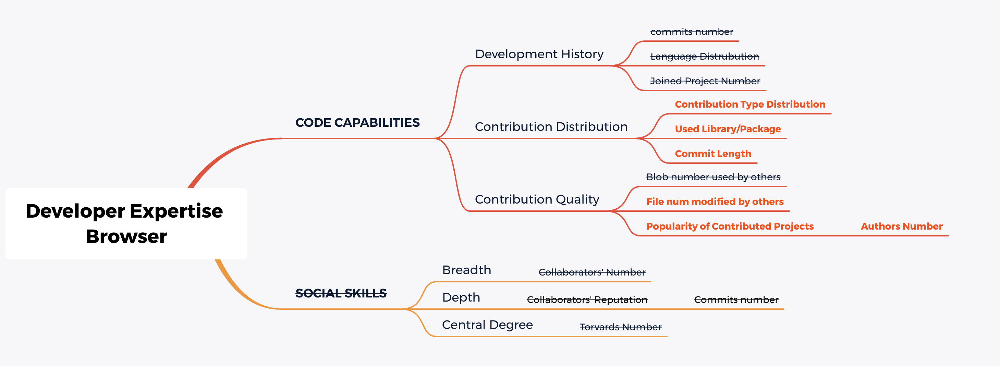

# DEB: Developer expertise browser

## Project Information
We want to build a developer expertise browser based on WoC and an awesome project [DRE](https://github.com/ssc-oscar/DRE). [DRE](https://github.com/ssc-oscar/DRE) has done a great job on developer profile. 

## Team Members
- Kai Gao (PKU, GMT+8)
- Jianyu Wu (PKU, GMT+8)
- Haiqiao Gu (THU, GMT+8)

## Team Plan

### Research questions

#### RQ1: How do we characterize developer's expertise from World of Code?

1. Code capabilities
    - Development history
    	- ~~commit number~~
    	- ~~language distribution~~
    	- ~~joined project number~~
    	- **language experience**
    - Contibution history
    	- **commit type distribution**
    	- **mastered libraty/package and experience**: build author2package2timestamp map based on c2bPtaPkg map.
    	- **commit average length**
    - Contribution quality
    	- ~~blob number used by others~~
    	- **Files' modified times by others**: author2project, project2commit, sort commit by time and traverse from the latest commit to the earliest and count.
    	- **popularity of joined projects: project's contributor number**: 
2. Social skills
    - Breadth: ~~collaborator number~~
    - Depth: ~~collaborator's commit number~~
    - Central degree: ~~Torvald distance~~
    - author-commiter ship: We want to build a author-committer map by iterating all commit data in WoC.

#### RQ2: What types of commit are there and can we automatically classify them?
We want to find projects whose commits follow angular's commit format from WoC. There commits are labeled types by developers when submitting a commit. We then can build a classifier on these manually labelled commit (commit message and commit type) to automatically classify commit.